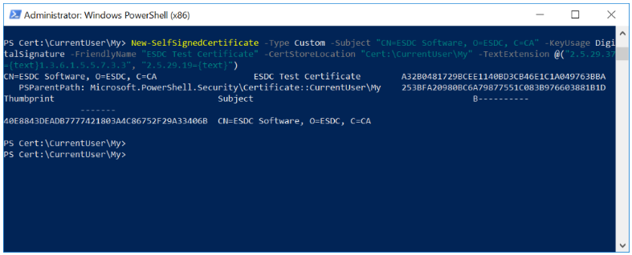
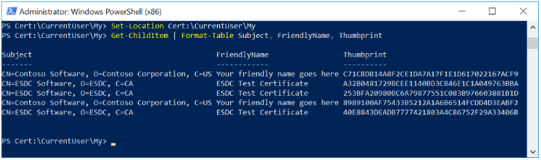
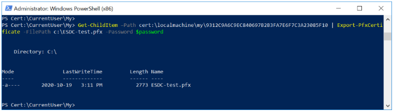

McAfee analyse le contenu du code et se déclenche lorsqu'il devient nerveux à propos de certains comportements (comme jouer dans le registre ou appeler d'autres programmes, etc.). Il peut bloquer les programmes internes ainsi que les logiciels standard. La solution la plus simple consiste à reconnaître la source comme étant fiable. Par exemple, si Adobe émet un logiciel, McAfee lui fera confiance car nous faisons confiance à sa réputation (même si une partie du code est suspecte).

La solution recommandée consiste à émettre des certificats de "signature de code" aux programmeurs. Dans McAfee Threat Intelligence Exchange (TIE), une réputation de confiance pourrait être donnée à la provenance (émetteur de certificat) et nous ferions automatiquement confiance à tous les programmeurs. C'est la solution propre et soutenable. Si un programmeur vendait son certificat EDSC sur le "Dark Web" et que nous le découvrions, le certificat pourrait être révoqué par l'autorité de certification ou se voir attribuer une non-confiance à ce certificat particulier dans TIE.

## Instructions pour créer des certificats auto-signés

### Applications Web

1. Ouvrez une fenêtre PowerShell **en tant qu'Administrateur** et entrez la commande suivante: 

   `New-SelfSignedCertificate -CertStoreLocation Cert:\LocalMachine\My -DnsName "mysite.local" -FriendlyName "MySiteCert" -NotAfter (Get-Date).AddYears(10)`

   Cela créera un certificat auto-signé spécifique pour mysite.local qui est valable 10 ans. Vous pouvez modifier le nombre d'années en modifiant la valeur dans la fonction AddYears.
   
   
   
2. Une fois le certificat créé, vous devez le copier dans le magasin des autorités de certification racines de confiance.

3. À l'aide de la recherche Cortana dans Windows 10, tapez «certlm.msc» et **exécutez-le en tant qu'administrateur**.

4. Dans le panneau de gauche, accédez à Certificats - Ordinateur local → Personnel → Certificats
   
   
	   
5. Localisez le certificat créé (dans cet exemple, regardez sous la colonne Émis à "mysite.local" ou sous la colonne Nom convivial "MySiteCert").
   
6. Dans le panneau de gauche, ouvrez (mais ne naviguez pas vers) Certificats - Ordinateur local → Autorités de certification racines de confiance → Certificats
   
7. Avec le bouton droit de la souris, faites glisser et déposez le certificat de **Personnel → Certificats** vers **Autorités de certification racines de confiance → Certificats** ouverts à l'étape précédente.
   
8. Sélectionnez "Copier ici" dans le menu contextuel.

### Applications de bureau

1. Ouvrez une fenêtre PowerShell en tant qu'**administrateur** et entrez la commande suivante (modifiez les paramètres CN, FriendlyName et CertStoreLocation en conséquence):

   `New-SelfSignedCertificate -Type Custom -Subject "CN=ESDC Software, O=ESDC, C=CA" -KeyUsage DigitalSignature -FriendlyName "ESDC Test Certificate" -CertStoreLocation "Cert:\CurrentUser\My" -TextExtension @("2.5.29.37={text}1.3.6.1.5.5.7.3.3", "2.5.29.19={text}")`

   Notez les détails suivants sur certains des paramètres:

   - **KeyUsage**: Ce paramètre définit ce à quoi le certificat peut être utilisé. Pour un certificat auto-signé, ce paramètre doit être défini sur **DigitalSignature**.
   - **TextExtension**: ce paramètre inclut les paramètres pour les extensions suivantes:
      - "Extended Key Usage" (EKU): cette extension indique des fins supplémentaires pour lesquelles la clé publique certifiée peut être utilisée. Pour un certificat d'auto-signature, ce paramètre doit inclure la chaîne d'extension **"2.5.29.37={text}1.3.6.1.5.5.7.3.3"**, qui indique que le certificat doit être utilisé pour la signature de code.
      - "Basic Constraints": cette extension indique si le certificat est ou non une autorité de certification (CA). Pour un certificat à signature automatique, ce paramètre doit inclure la chaîne d'extension **"2.5.29.19={text}"**, qui indique que le certificat est une entité finale (et non une autorité de certification).

   Après avoir exécuté cette commande, le certificat sera ajouté au magasin de certificats local, comme spécifié dans le paramètre "-CertStoreLocation". Le résultat de la commande produira également l'empreinte numérique du certificat.
   
      

2. Vous pouvez afficher votre certificat dans une fenêtre PowerShell à l'aide des commandes suivantes:

   `Set-Location Cert:\CurrentUser\My`
   `Get-ChildItem | Format-Table Subject, FriendlyName, Thumbprint`
   
    Cela affichera tous les certificats dans votre magasin local.
	
   
	
## Exporter un certificat (Pour les applications de bureau)

Pour exporter le certificat du magasin local vers un fichier PFX (Personal Information Exchange), utilisez la commande Export-PfxCertificate.

Lorsque vous utilisez **Export-PfxCertificate**, vous devez soit créer et utiliser un mot de passe, soit utiliser le paramètre "-ProtectTo" pour spécifier les utilisateurs ou groupes qui peuvent accéder au fichier sans mot de passe. Notez qu'une erreur s'affichera si vous n'utilisez ni le paramètre "-Password" ni "-ProtectTo".

### Utilisation du mot de passe

   Mettez à jour **Votre mot de passe**, **FilePath** et **Thumbprint** en conséquence.

   `$password = ConvertTo-SecureString -String <Votre mot de passe> -Force -AsPlainText`
   `Get-ChildItem –Path cert:\CurrentUser\my\<9312C9A6C9EC840697B2B3FA7E6F7C3A23085F10> | Export-PfxCertificate -FilePath <C:\ESDC-test.pfx> -Password $password`

   

   Après avoir créé et exporté votre certificat, vous êtes prêt à signer votre package d'application avec **SignTool**. Pour l'étape suivante du processus d'empaquetage manuel, voir [Signer un package d'application à l'aide de SignTool](https://docs.microsoft.com/fr-ca/windows/msix/package/sign-app-package-using-signtool). 
   
## Considérations de sécurité

En ajoutant un certificat aux [magasins de certificats de la machine locale](https://docs.microsoft.com/fr-ca/windows-hardware/drivers/install/local-machine-and-current-user-certificate-stores), vous affectez la confiance de certificat de tous les utilisateurs de l'ordinateur. Il est recommandé de supprimer ces certificats lorsqu'ils ne sont plus nécessaires pour éviter qu'ils ne soient utilisés pour compromettre la confiance du système.
   