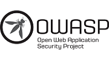

# Table of Contents
- [Threat Modeling explained](#threat-modeling-explained)
- [OWASP Threat Modeling Cheat Sheet](#owasp-threat-modeling-cheat-sheet)
- [OWASP Threat Dragon](#owasp-threat-dragon)

# Threat Modeling explained

Threat modelling works to identify, communicate, and understand threats and mitigations within the context of protecting something of value.

Threat modelling can be applied to a wide range of things, including software, applications, systems, networks, distributed systems, things in the internet of things, business processes, etc. There are very few technical products which cannot be threat modelled; more or less rewarding, depending on how much it communicates, or interacts, with the world. Threat modelling can be done at any stage of development, preferably early - so that the findings can inform the design.

[Read more...](https://owasp.org/www-community/Application_Threat_Modeling)

-----

# OWASP Threat Modeling Cheat Sheet
 

Objective of the Threat Modelling Control Cheat Sheet – To provide guidance to architects, designers and reviewers, on deriving threat models for applications.

Audience for this cheat sheet:

1.  Designers and Architects.
1.  Threat Modeling SMEs or Security Assessors who are responsible for analyzing the security of the entire applications’ components.

[OWASP Cheat Sheet](https://cheatsheetseries.owasp.org/cheatsheets/Threat_Modeling_Cheat_Sheet.html)

-----

# OWASP Threat Dragon

[Download Threat Dragon](https://github.com/mike-goodwin/owasp-threat-dragon) 
[Online Version](https://threatdragon.org/login)

OWASP Threat Dragon (TD) is a tool used to create threat model diagrams and to record possible threats and decide on their mitigations.

TD is both an online threat modelling web application and a desktop application, and includes system diagramming and a rule engine to auto-generate threats/mitigations. The focus of TD is on great UX, a powerful rule engine and alignment with other development lifecycle tools.

[Read more...](https://owasp.org/www-project-threat-dragon/)